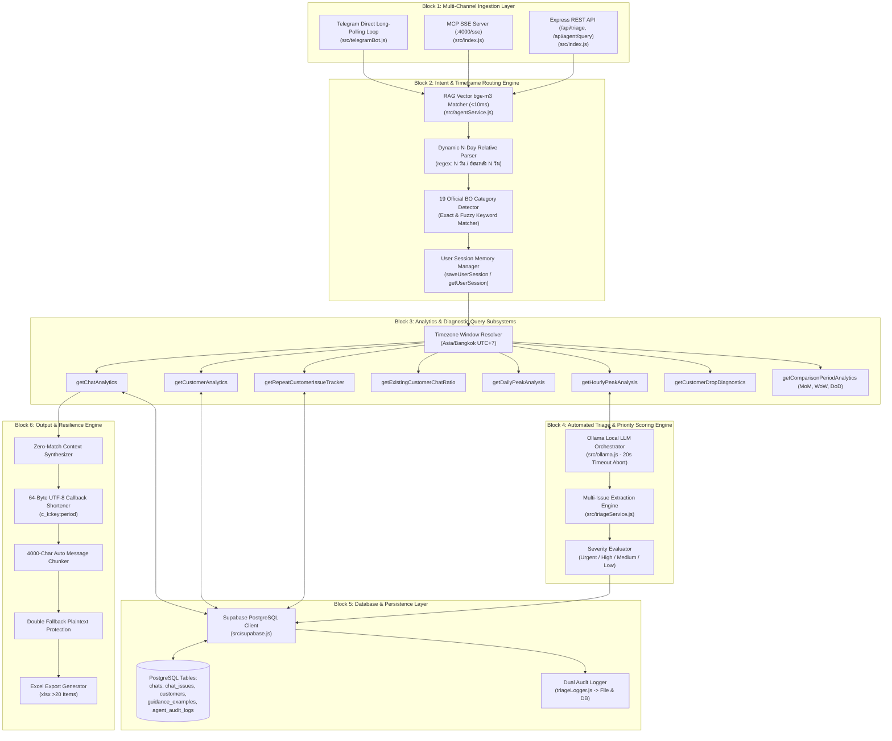

# 🏛️ AI Triage & Analytics Platform - Enterprise Technical Architecture Specification

เอกสารสรุปแผนภาพและสถาปัตยกรรมระบบ **AI Triage & Analytics System** ฉบับสมบูรณ์สำหรับ **Senior Developer / Lead Architect** ครอบคลุมการทำงานของ Subsystem ทั้ง 6 บล็อกหลัก โครงสร้างไฟล์ อัลกอริทึม และการรับมือ Edge Cases

---

---

## 🧭 System Component Architecture Map

---

## 🛠️ Detailed Subsystem Specifications

### 1️⃣ Block 1: Multi-Channel Ingestion Layer
* **Files**: [`src/index.js`](file:///c:/Users/USER/Downloads/AI%20Triage/src/index.js), [`src/telegramBot.js`](file:///c:/Users/USER/Downloads/AI%20Triage/src/telegramBot.js)
* **Architecture**:
  * **Express Application (`:4000`)**: รัน HTTP Server ให้บริการ REST API endpoints สำหรับการทดสอบและเชื่อมต่อระบบภายนอก
  * **Model Context Protocol (MCP) Server**: ให้บริการ `/sse` (Server-Sent Events) และ `/messages` สำหรับการสื่อสารแบบ 2 ทางระหว่าง AI Agents และ IDE
  * **Telegram Direct Long-Polling**: ใช้ `callTelegramAPISingle('getUpdates', ...)` ดึงข้อความจาก Telegram Group / Private Chat แบบ Long-Polling ไร้ความหน่วง โดยไม่ต้องพึ่งพา Webhook หรือ Public IP Expose

---

### 2️⃣ Block 2: Intent & Timeframe Routing Engine
* **Files**: [`src/agentService.js`](file:///c:/Users/USER/Downloads/AI%20Triage/src/agentService.js)
* **Algorithms & Logic**:
  * **RAG Vector bge-m3 Sub-10ms Matcher**: ทำ Vector Embedding Search ค้นหาความคล้ายคลึงของคำถามเปรียบเทียบกับ `guidance_examples` ในฐานข้อมูล หากค่า Similarity >75% จะเลือกเครื่องมือให้ตรงกับเจตนาทันที
  * **Dynamic N-Day Relative Parser**:
    * สกัดตัวเลขจำนวนวันย้อนหลัง $N$ จากข้อความภาษาไทยผ่าน Regex: `/(?:ย้อนหลัง|ช่วง|สรุปย้อนหลัง)?\s*(\d+)\s*วัน/i`
    * คำนวณช่วงเวลาแบบ Dynamic สำหรับคำถามประเภท `2 วัน`, `7 วัน`, `10 วัน`, `15 วัน`, `30 วัน` โดยอัตโนมัติ
  * **19 Official Backoffice Category Keyword Filter**:
    * ดักจับคำสั่งวิเคราะห์หมวดหมู่ปัญหา 19 หมวดมาตรฐานขององค์กร:
      `deposit_withdrawal`, `login_issue`, `access_blocked`, `account_security`, `api_error`, `device_compatibility`, `feature_request`, `feedback_complaint`, `game_issue`, `interaction_lag`, `notification_issue`, `page_load_freeze`, `payment_gateway`, `performance_issue`, `promo_bonus`, `registration`, `ui_rendering_issue`, `vip_privilege`, `other`
  * **User Session Memory Manager**:
    * จัดเก็บ Session Context ล่าสุดตาม Chat ID (`saveUserSession` / `getUserSession`) เพื่อรองรับคำถามติดตามผล (Contextual Follow-up) เช่น *"มีใครบ้าง"*, *"ขอรายละเอียดหมวดที่ 1"*

---

### 3️⃣ Block 3: Analytics & Diagnostic Query Subsystems
* **Files**: [`src/financialMarketingService.js`](file:///c:/Users/USER/Downloads/AI%20Triage/src/financialMarketingService.js)
* **Query Engines**:
  * **Timezone Window Resolver (`resolveDynamicTimeframe`)**: กำหนดช่วงวันเวลาตามเวลาประเทศไทย (Asia/Bangkok, UTC+7) `[startCutoff, endCutoff)` ป้องกันปัญหาข้อมูลคาบเกี่ยววัน
  * **`getChatAnalytics`**: สรุปจำนวนแชท, จำนวนกรณีปัญหา, เปอร์เซ็นต์หมวดหมู่หลัก, และระดับความสำคัญ (Urgent/High/Medium/Low)
  * **`getCustomerAnalytics`**: สรุปสถิติลูกค้าใหม่, ลูกค้าทั้งหมด, และรายละเอียดแชทของลูกค้ารายบุคคล
  * **`getRepeatCustomerIssueTracker`**: ตรวจจับลูกค้าที่ทักเข้ามาแจ้งปัญหาหมวดหมู่เดิมซ้ำภายใน 24 ชม.
  * **`getExistingCustomerChatRatio`**: คำนวณสัดส่วนแชตระหว่างลูกค้าเก่า (Existing Users) vs ลูกค้าใหม่ (New Users)
  * **`getDailyPeakAnalysis` / `getHourlyPeakAnalysis`**: วิเคราะห์วันและช่วงชั่วโมงหนาแน่น (00:00 - 23:59 น.) พร้อมจำแนกหมวดหมู่ปัญหาในช่วงพีค
  * **`getCustomerDropDiagnostics`**: วิเคราะห์จุดติดขัดที่ทำให้ลูกค้าละทิ้งการใช้งานระบบ
  * **`getComparisonPeriodAnalytics`**: เปรียบเทียบสถิติรายเดือน (MoM), รายสัปดาห์ (WoW), และรายวัน (DoD)

---

### 4️⃣ Block 4: Automated Triage & Priority Scoring Engine
* **Files**: [`src/triageService.js`](file:///c:/Users/USER/Downloads/AI%20Triage/src/triageService.js), [`src/ollama.js`](file:///c:/Users/USER/Downloads/AI%20Triage/src/ollama.js)
* **Algorithms**:
  * **Ollama Local LLM Orchestrator**: บริหารจัดการการประมวลผลภาษาธรรมชาติจากโมเดลท้องถิ่น พร้อมระบบ **20s HTTP Timeout Abort** เพื่อความรวดเร็ว
  * **Multi-Issue Extraction Algorithm**: ทำการจำแนกข้อความลูกค้ายาวๆ 1 ข้อความ ออกเป็นปัญหาย่อยหลายรายการ (Multi-Issue Triage)
  * **Severity Scoring Engine**: ประเมินระดับความสำคัญออกเป็น 4 ระดับ: `urgent` (ด่วนที่สุด), `high` (สูง), `medium` (กลาง), `low` (ต่ำ)

---

### 5️⃣ Block 5: Database & Persistence Layer
* **Files**: [`src/supabase.js`](file:///c:/Users/USER/Downloads/AI%20Triage/src/supabase.js), [`src/triageLogger.js`](file:///c:/Users/USER/Downloads/AI%20Triage/src/triageLogger.js)
* **Database Architecture**:
  * เชื่อมต่อ Supabase PostgreSQL ทำการสืบค้นและอัปเดตตาราง `chats`, `chat_issues`, `customers`, `guidance_examples`, `agent_audit_logs`
  * **Dual Audit Logger Engine**: เขียนบันทึก Log การวิเคราะห์คำถามของ AI สองทางพร้อมกัน (ลงไฟล์ `logs/triage_audit.log` และลงตาราง DB `agent_audit_logs`) เพื่อความโปร่งใสและตรวจสอบย้อนหลังได้ 100%

---

### 6️⃣ Block 6: Output & Resilience Engine
* **Files**: [`src/telegramBot.js`](file:///c:/Users/USER/Downloads/AI%20Triage/src/telegramBot.js), [`src/excelService.js`](file:///c:/Users/USER/Downloads/AI%20Triage/src/excelService.js)
* **Resilience Mechanism**:
  * **64-Byte UTF-8 Callback Shortener (`c_k:${key}:${period}`)**:
    * Telegram API จำกัดขนาด `callback_data` บนปุ่มกดInline ไม่เกิน **64 Bytes** (UTF-8)
    * แปลงชื่อหมวดภาษาไทยเป็นรหัส ASCII สั้น (เช่น `c_k:payment_gateway:today` = 25 Bytes) เพื่อการันตีว่าปุ่มกดจะไม่มีวันส่งผล `400 Bad Request: BUTTON_DATA_INVALID`
  * **Zero-Match Context Synthesizer**:
    * กรณีผู้ใช้ถามหาหมวด特定แต่ไม่พบปัญหา (0 กรณี) ระบบจะเกริ่นตอบ 0 กรณีอย่างชัดเจนก่อน แล้วดึงหมวดหมู่ปัญหาสูงสุดประจำวันนั้นมาแสดงต่อท้ายให้อัตโนมัติ
  * **Auto 4000-Character Message Chunker**:
    * หากคำตอบยาวเกิน 3800 ตัวอักษร ระบบจะทำการตัดแบ่งเป็นหลายข้อความส่งต่อเนื่องโดยไม่ตัดคำเสีย
  * **Double Fallback Plaintext Retry Protection**:
    * หาก Telegram ปฏิเสธการส่งข้อความจากปัญหา Markdown หรือ ปุ่มกด ระบบจะทำการ **Retry รอบที่ 2 โดยการถอด `reply_markup` ออกและส่ง Plaintext** เพื่อการันตีว่าคำตอบจะถึงมือผู้ใช้ 100% สกัดอาการบอทค้าง
  * **Excel Export Generator (`xlsx`)**:
    * กรณีดึงสถิติแล้วมีข้อมูลมากกว่า 20 รายการ ระบบจะสร้างไฟล์ `.xlsx` ฉบับเต็มและส่งผ่าน Telegram ให้เปิดดูผ่าน Excel ทันที

---

## 📊 Summary of Technical Reliability Standards

| Component | Technical Mechanism | Failure Recovery / Safety Buffer |
| :--- | :--- | :--- |
| **Intent Matcher** | RAG bge-m3 Embedding Search | Fallback to Rule-based Classifier if score < 75% |
| **Timeframe Resolver** | Dynamic Regex + UTC+7 Window Boundary | Fallback to active session period or today |
| **LLM Inference** | Ollama Local Instance with 20s Abort | Fallback to Rule-based Data Analytics Formatter |
| **Telegram Callback Data** | ASCII Key Mapping (`c_k:key:period`) | Strictly capped at <= 33 bytes (Limit 64 bytes) |
| **Telegram Message Resend** | Multi-chunking + Double Resend | Strips buttons & markdown formatting on 2nd retry |
| **Data Export** | `excelService.js` (SheetJS / xlsx) | Auto-generates binary `.xlsx` for datasets > 20 rows |
