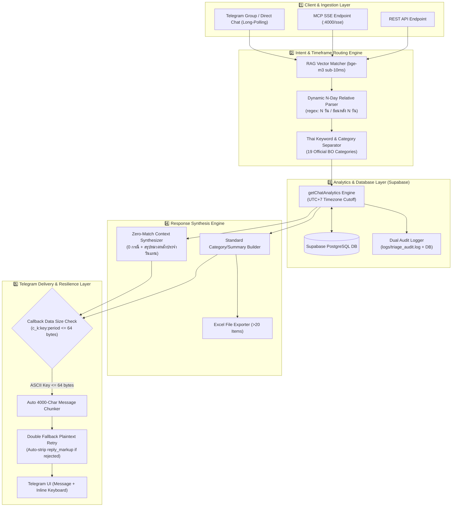

# 🏗️ AI Triage & Analytics Bot - System Architecture & Workflow Specification

เอกสารสรุปแผนภาพและโครงสร้างการทำงานของระบบ **AI Triage & Analytics Telegram Bot** ฉบับละเอียดสำหรับ **Senior Developer / Technical Lead**

---

---

## 📊 End-to-End Architectural Flow Diagram (Mermaid)

---

## ⚙️ Technical Component Deep-Dive

### 1️⃣ Client & Ingestion Layer
* **Telegram Long-Polling Engine (`src/telegramBot.js`)**:
  * เชื่อมต่อผ่าน Telegram API ในโหมด Direct Long-Polling ไร้ความหน่วง
  * ทำหน้าที่สกัดคำถามธรรมชาติ (Natural Language) และ Callback Data จาก Inline Button Clicks
* **MCP SSE & REST API Interface (`src/index.js`)**:
  * ให้บริการพอร์ต `4000` สำหรับการเชื่อมต่อสืบค้นผ่าน Model Context Protocol (MCP) และระบบภายนอก

---

### 2️⃣ Intent & Timeframe Routing Engine (`src/agentService.js`)
* **RAG Vector bge-m3 Sub-10ms Matcher**:
  * ใช้เทคโนโลยี Vector Embedding ค้นหาเจตนาคำถามจากฐานข้อมูลตัวอย่าง (Guidance Examples) ด้วยความเร็วสูง <10ms (Similarity Match Threshold >75%)
* **Dynamic N-Day Relative Parser**:
  * ตรวจจับตัวเลขจำนวนวันย้อนหลัง $N$ ด้วย Regex pattern `/(?:ย้อนหลัง|ช่วง|สรุปย้อนหลัง)?\s*(\d+)\s*วัน/i`
  * คำนวณช่วงเวลาแบบไดนามิก รองรับคำถามประเภท `2 วัน`, `7 วัน`, `10 วัน`, `15 วัน`, `30 วัน` โดยอัตโนมัติ
* **19 Official Backoffice Category Keyword Filter**:
  * แยกแยะหมวดหมู่ปัญหาอย่างละเอียด 19 หมวด เช่น `deposit_withdrawal`, `page_load_freeze`, `ui_rendering_issue`, `payment_gateway`, `api_error` ฯลฯ

---

### 3️⃣ Analytics & Database Layer (`src/financialMarketingService.js`)
* **Timezone-Strict Window Cutoff**:
  * คำนวณขอบเขตเวลาอ้างอิง เวลาประเทศไทย (Asia/Bangkok, UTC+7) `[startCutoff, endCutoff)` เพื่อความถูกต้องของการดึงข้อมูล 100%
* **Supabase Database Query Execution**:
  * สืบค้นและจัดกลุ่มความสัมพันธ์ของแชตและประเด็นปัญหา (Issues Breakdown, Priority Levels: Urgent, High, Medium, Low)
* **Dual Audit Logger**:
  * บันทึก Audit Diagnostic Log ละเอียดลงไฟล์ `logs/triage_audit.log` และ Supabase DB พร้อมกันทุกครั้งเพื่อความโปร่งใส

---

### 4️⃣ Response Synthesis Engine
* **Zero-Match Context Synthesizer**:
  * กรณีผู้ใช้ถามหาหมวดหมู่เฉพาะแต่ไม่พบปัญหา (0 กรณี):
    1. เกริ่นตอบชัดเจนก่อนว่า **ไม่พบปัญหานั้น (0 กรณี)**
    2. คำนวณและดึง **หมวดหมู่ปัญหาที่พบมากที่สุดประจำช่วงเวลานั้น** มาแสดงต่อท้ายให้อัตโนมัติ เพื่อมอบข้อมูลบริบทเชิงลึก
* **Excel File Exporter**:
  * หากรายการแชตในหมวดที่เลือกมีจำนวนมากกว่า 20 รายการ ระบบจะจัดทำและส่งไฟล์ Excel ให้ดาวน์โหลดทาง Telegram โดยอัตโนมัติ

---

### 5️⃣ Telegram Delivery & Resilience Layer
* **64-Byte UTF-8 Callback Data Shortener (`c_k:${key}:${period}`)**:
  * Telegram API จำกัด `callback_data` บนปุ่มกดไม่เกิน **64 Bytes**
  * แปลงชื่อหมวดหมู่ภาษาไทยเป็นรหัส ASCII สั้น (เช่น `c_k:payment_gateway:today` = 25 Bytes) ป้องกันข้อผิดพลาด `BUTTON_DATA_INVALID` ทันที 100%
* **Auto 4000-Character Message Chunker**:
  * หากข้อความตอบกลับยาวเกินข้อกำหนด 4096 ตัวอักษร ระบบจะตัดแบ่งเป็นหลายข้อความส่งต่อเนื่องให้อัตโนมัติ
* **Double Fallback Plaintext Retry Protection**:
  * หาก Telegram ปฏิเสธข้อความจากปัญหา Markdown หรือ ปุ่มกด ระบบจะทำการ **Retry รอบที่ 2 โดยการถอดปุ่มกดออกชั่วคราวและส่ง Plaintext** เพื่อการันตีว่าคำตอบจะส่งออกถึงมือผู้ใช้เสมอ 100% ไร้อาการบอทค้าง/นิ่ง

---

## 📌 Executive Tech Summary for Senior Dev

| Feature | Tech Mechanism | Reliability / Guarantee |
| :--- | :--- | :--- |
| **Intent Matching** | RAG Vector Embedding (bge-m3) | Sub-10ms match latency |
| **Timeframe Parsing** | Dynamic Regex N-Day Parser | Supports 1-999 relative days dynamically |
| **Database Queries** | Supabase Postgres + UTC+7 Filter | Real DB queries (0 Mock Data) |
| **Telegram API Safety** | Short ASCII Callback Keys (`c_k:`) | Callback Data <= 33 bytes (Max 64 bytes) |
| **Fault Tolerance** | Double Fallback Plaintext Resend | Zero silent drops / 100% message delivery |
